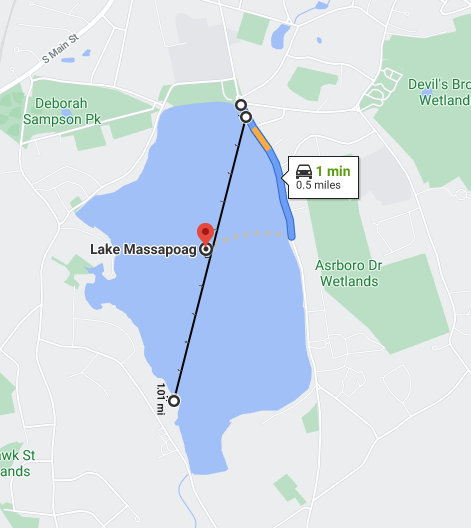

# LoRa  

LoRa is a wireless technology that offers long range, low power and secure data transmission for IoT applications. LoRa can be used to connect sensors, gateways, machines, devices, animals, people etc. wirelessly to the cloud.  
Learn More:
https://www.semtech.com/lora/what-is-lora

# Tinker with LoRa - a low bandwidth network that reaches long distances (30 miles or less in rural areas) with little power

# Lora Range Compare to WiFi, BT, Cellular (Range vs Data Rate)   

** LPWAN: A low-power wide-area network **

# Distance testing in residential areas (across houses, woods, wetland and lake)
Between two adjacent cities (no cellutar, no wifi, just Chirp Modulation)

## Understanding of Chirp Modulation
 - https://www.nature.com/articles/s41467-018-04822-4
 - https://en.wikipedia.org/wiki/Chirp_spread_spectrum
 

# LoRa Gateways
The LoRa sensors (IoT devices) transmit data to the LoRa gateways. 
The LoRa gateways connect to the internet via the standard IP protocol and transmit the data received from the LoRa embedded sensors to the Internet i.e. a network, server or cloud. <b>The Gateways connect to the network server via standard IP connections and act as a transparent bridge, simply converting RF packets to IP packets and vice versa.</b>

# Tools: AWS IoT for LoRaWAN 

# Capturing LoRa Communication in my SDR nooelect Radio at 915Mhz (CubicSDR)

- https://www.nooelec.com/store/

# LoRa Application
- https://github.com/ObjectMatrix/LoRa/blob/main/docs/lora-docs-css.md 
- https://www.semtech.com/lora/lora-applications/smart-agriculture  
- https://www.semtech.com/company/press/semtech-and-lar.tech-enable-smart-ranching-with-lora-technology

# An Interesting and Useful Use Case

## Webinar. 
Dec 21, 2020

https://gateway.on24.com/wcc/eh/2820560/lp/2822106/
